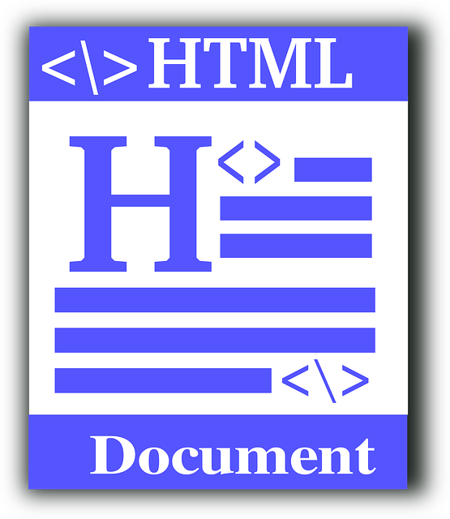
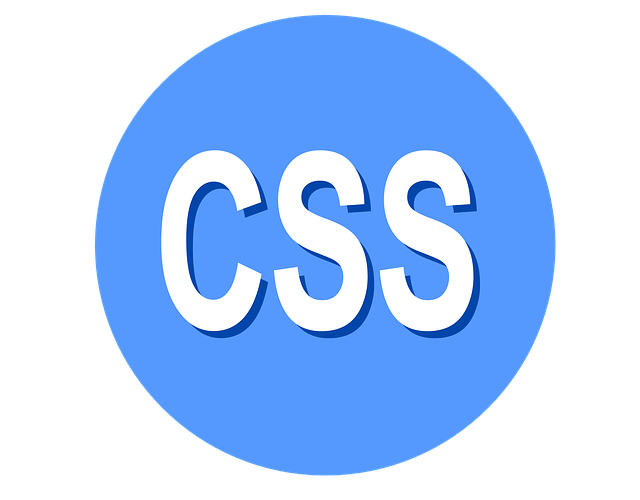

# reprogram-exercicio1

## HTML

  HTML significa Hypertext Markup Language. Ele permite que os usuários criem e estruturem seções, parágrafos,  cabeçalhos e links para páginas da internet ou aplicações.

  O HTML não é uma linguagem de programação, isso significa que não pode ser usado para criar funcionalidades   dinâmicas. Entretanto, o HTML possibilita a organização e formatação de documentos, similar ao Microsoft Word.

  Ao trabalhar com HTML simplesmente codificamos estruturas (tags e atributos) para marcar a página de um site. 

## CSS

  CSS é chamado de linguagem Cascading Style Sheet e é usado para estilizar elementos escritos em uma linguagem   de marcação como HTML. O CSS separa o conteúdo da representação visual do site. Pense  na decoração da sua página.  Utilizando o CSS é possível alterar a cor do texto e do fundo, fonte e espaçamento entre parágrafos. Também pode   criar tabelas, usar variações de layouts, ajustar imagens para suas respectivas telas e assim por diante.

  CSS foi desenvolvido pelo W3C (World Wide Web Consortium) em 1996, por uma razão bem simples. O HTML não foi  projetado para ter tags que ajudariam a formatar a página.  Você deveria apenas escrever a marcação para o site.

### A relação entre HTML e CSS é bem forte. Como o HTML é uma linguagem de marcação   (o alicerce de um site) e o CSS é focado no estilo (toda a estética de um site), eles andam juntos.   CSS não é tecnicamente uma necessidade, mas provavelmente você não gostaria de olhar para um site   que usa apenas HTML, pois isso pareceria completamente abandonado.  

